# Aiven Kafka Quickstart with Nodejs

Aiven for Apache Kafka® is a fully managed distributed data streaming platform, deployable in the cloud of your choice. Aiven enables you to deploy a production grade kafka service with just a few clicks.

In this article we will deploy a kafka service and create a Node.js producer to publish battery alerts from IOT devices. We will also demonstrate monitoring of our kafka service using InfluxDB and Grafana services provided by Aiven.

Note: You will need an Aiven account to follow along the instructions in this tutorial. Please register at aiven.io, Aiven will provide a credit of $300 for one month, which is sufficient for ˇthis excercise.

# Creating Aiven for Apache Kafka Service

Aiven provides an intuitive web console to create and manage services. Login to the console, go to "Services" menu option to create a new service and follow these steps:

1. Select "Apache Kafka" service.
2. Select the cloud provider of your choice. e.g. AWS
3. Select the region where you would like the kafka service to be deployed. e.g. aws-eu-west-2
4. Select Business plan. For this article we will choose a "Startup" plan.
5. Provide a name for your service. For this article we will name it "kafka-nodejs".

Console will display selected options and estimated monthly price, review the details and click "Create Service". Aiven will take care of all the complexity of deploying kafka service in the cloud and region of your choice.

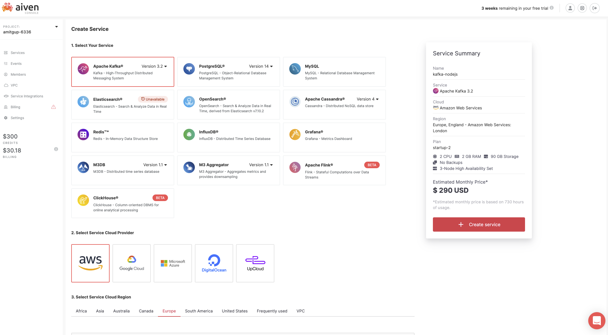

Wait for service status to change from "Rebuilding" to "Running" before proceeding further.

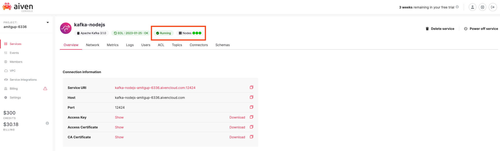

## Create New Topic

Once the kafka service is running, go to the Topics tab and add a new topic. We will name this topic as 'battery-alerts' to publish battery alerts from IOT devices.

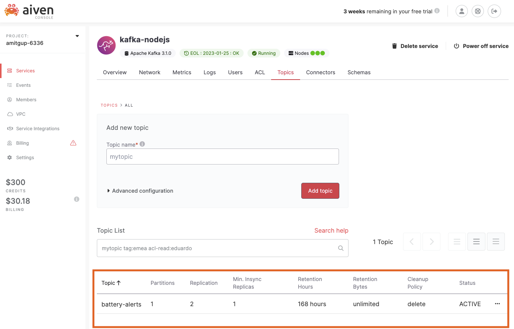

# Node.js Producer

In this section we will create a Node.js producer to publish IOT device events to our kafka service. We will use open source kafka client called [kafkajs](https://www.npmjs.com/package/kafkajs).

## Prerequists

1. Node.js must be installed on your machine. If you don’t have it installed, visit [Node.js](https://nodejs.org/en/) to install the most recent Long Term Support (LTS) version.
2. Make sure your Aiven kafka service is in 'Running' status.

## Code Setup

Follow these instructions to clone the git repository and install dependencies.

```
# Clone the git repository
$ git clone https://github.com/d20amit/aiven-kafka-nodejs.git

# Change to project directory
$ cd aiven-kafka-nodejs

# Install dependencies, this will install kafkajs and other dependencies
$ npm install
```

## Connection Information

Take a note of 'Service URI' from the Kafka service Overview tab, we will need this URI in the next step to connect to kafka service.

By default Aiven configures the kafka service with SSL authentication and encryption mechanism. Aiven also supports the SASL authentication mechanism, please [click here](https://developer.aiven.io/docs/products/kafka/concepts/auth-types.html) for more details. For this article we will use the default SSL authentication mechanism.

Download the Access Key, Access Certificate and CA Certificate from Aiven Kafka service 'Overview' tab and store them under 'secrets' directory within 'aiven-kafka-nodejs' project directory. Files should be downloaded by default with names 'service.key', 'service.cert' and 'ca.cer'. These files are your secrets to access the kafka service, these should be kept secure.

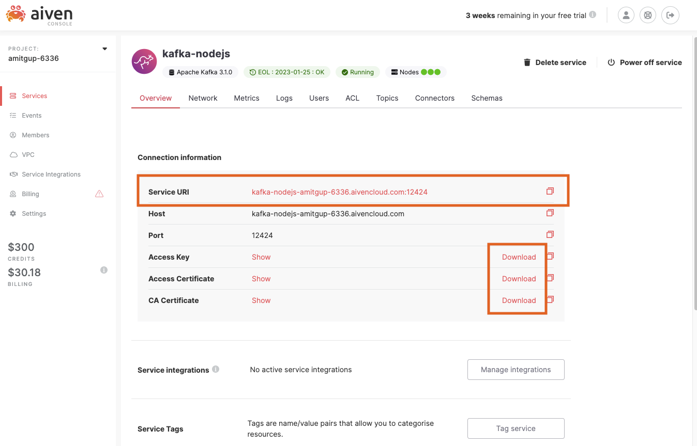

## Configure Connection

1. Check 'connection.js' file under 'aiven-kafka-nodejs' for code to configure connection details. Update 'AIVEN_KAFKA_SERVICE_URI' with 'Service URI' as noted from Aiven console's service Overview tab.

```
// replace the value with your kafka service URI
const AIVEN_KAFKA_SERVICE_URI = "YOUR KAFKA SERVICE URI";
```

2. Now we will use the secret files downloaded in earlier step to make a secure connection to our kafka service, make sure that 'service.key', 'service.cert' and 'ca.cer' files are downloaded under 'secrets' directory. Following code configures the connection (connection.js):

```
import { Kafka } from "kafkajs";
import fs from "fs";

// replace the value with your kafka service URI
const AIVEN_KAFKA_SERVICE_URI = "YOUR KAFKA SERVICE URI";

// Configure kafkajs for connection to Aiven Kafka
export const kafka = new Kafka({
  clientId: "aiven-kafka-nodejs",
  brokers: [AIVEN_KAFKA_SERVICE_URI],
  ssl: {
    // CA Certificate downloaded from Aiven Console
    ca: [fs.readFileSync("./secrets/ca.cer", "utf-8")],

    // Access Key downloaded from Aiven Console
    key: fs.readFileSync("./secrets/service.key", "utf-8"),

    // Access Certificate downloaded from Aiven Console
    cert: fs.readFileSync("./secrets/service.cert", "utf-8"),
  },
});
```

## Connect and Send Message

Following code (producer.js) connects to our kafka service and sends the battery alert message from 'securityCam-front-1' device to our kafka topic named 'battery-alerts'.

```
import { v4 as uuid4 } from "uuid";
import { kafka } from "./connection.js";

export async function publish() {
  let producer;

  try {
    producer = kafka.producer();

    // connect to aiven kafka service
    console.log("Connecting to kafka...");
    await producer.connect();
    console.log("Connection to Kafka succesful");

    // send message to kafka service
    const result = await producer.send({
      // topic as created in Aiven console
      topic: "battery-alerts",
      messages: [
        {
          // message key to determine topic partition
          key: JSON.stringify(uuid4()),

          // message itself sent as JSON with battery percentage along with timestamp in ISO format
          value: JSON.stringify({
            deviceId: "securityCam-front-1",
            batteryPercent: 14,
            timeStamp: new Date().toISOString(),
          }),
        },
      ],
    });

    console.log("Message sent succesfully", result);
  } catch (error) {
    console.log("Something went wrong:", error);
  } finally {
    // disconnect from kafka service before exiting
    if (producer) {
      await producer.disconnect();
    }
  }
}

```

## Execute the program

Execute following command from 'aiven-kafka-nodejs' directory to run the program and send a battery alert to our kafka topic.

```
# Command to execute the program
aiven-kafka-nodejs$npm run publish

# Sample output from the program
> aiven-kafka-nodejs@1.0.0 publish
> node index.js

Connecting to kafka...
Connection to Kafka succesful
Message sent succesfully [
  {
    topicName: 'battery-alerts',
    partition: 0,
    errorCode: 0,
    baseOffset: '3',
    logAppendTime: '-1',
    logStartOffset: '0'
  }
]
```

## Check Message In Aiven Console

In order to fetch messages in the Aiven console, we need to first enable Kafka Rest API on our kafka service. Go to the service overview tab and enable Rest API.

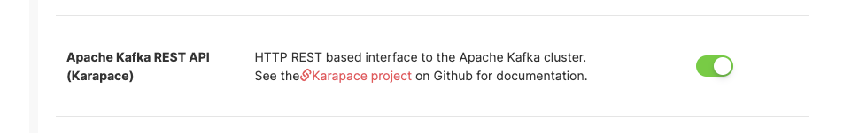

Once the Rest API is enabled we can fetch messages from 'battery-alert' topic from within the Aiven console. Follow these instructions:

1. Go to Topics > 'battery-alerts' topic > Messages.
2. Select json as Format.
3. Click 'Fetch messages'.

You should be able to see the message published in the previous step.

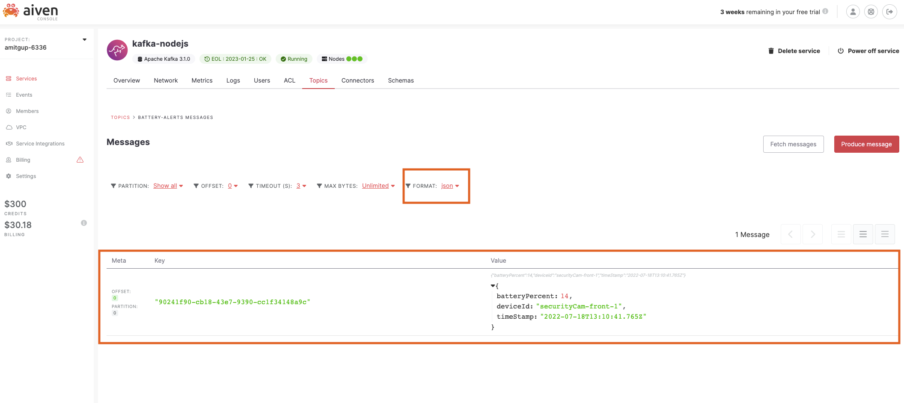

# Observability and Monitoring

So far we have deployed a kafka service and created a Node.js program to publish messages to our kafka service. For a business critical service, monitoring is a very important aspect. Aiven provides the ability to set up observability and monitoring of our kafka service with just a few clicks. In this section we will set up mechanism to publish kafka metrics to Aiven InfluxDB service and then visualize it using Aiven Grafana service.

## Create InfluxDB and Grafana services

First we will create new InfluxDB and Grafana services from 'Services' > 'Create a new service'.

Create InfluxDB service:

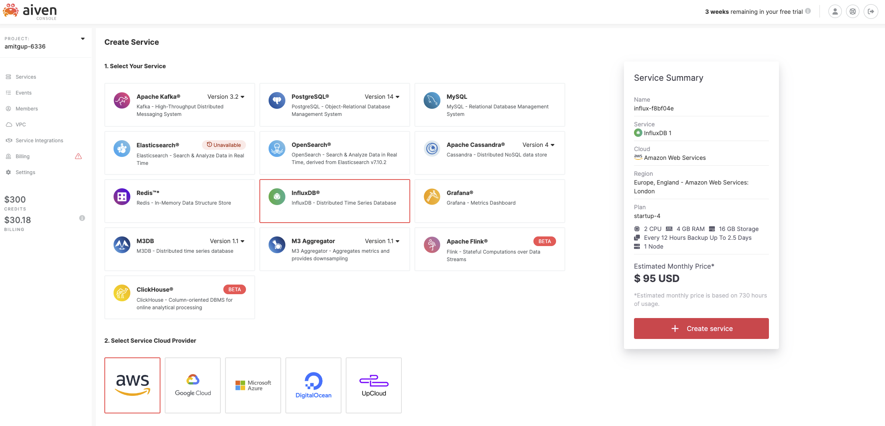

Then create a grafana service:
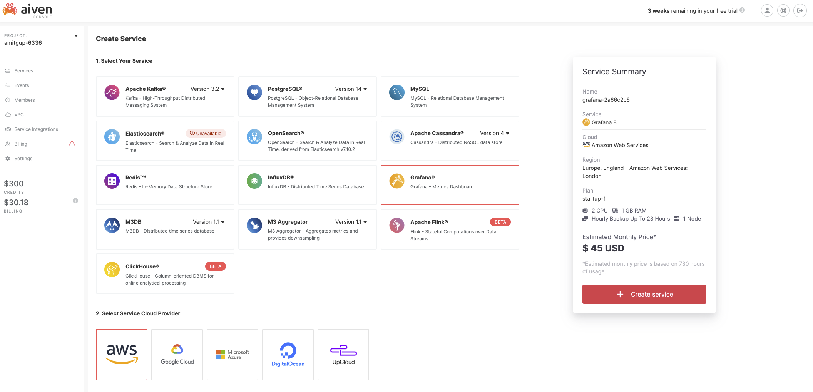

Now we should have Kafka, InfluxDB and Grafana services available under 'Services'. Wait for both new services' status to be changed to 'Running', this may take a few minutes.

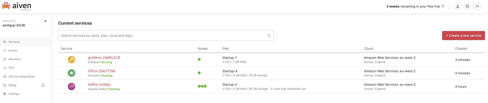

## Integrating Services

We need to integrate our services to be able to publish metrics to InfluxDB and then visualize it using Grafana.

First Go to InfluxDB service overview tab and locate 'Service Integration' section:

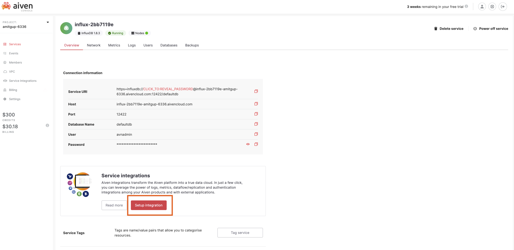

Now we will integrate InfluxDB with Kafka service to collect Kafka metrics data. For kafka metrics, select 'Metrics' integration type and then select the kafka service from the list of 'existing services'. Click 'Enable' to set up this integration.

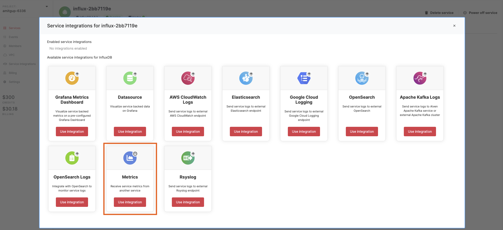

Finally we will integrate InfluxDB with Grafana for visualization. Select 'Grafana Metrics Dashboard' as integration type and then select the Grafana service we created earlier.

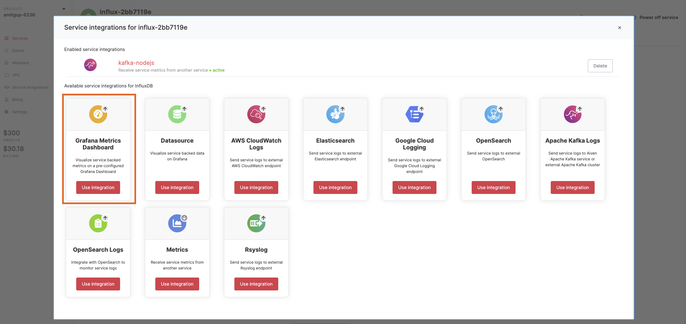

Now we should have both Kafka and Grafana services integrated with InfluxDB service:

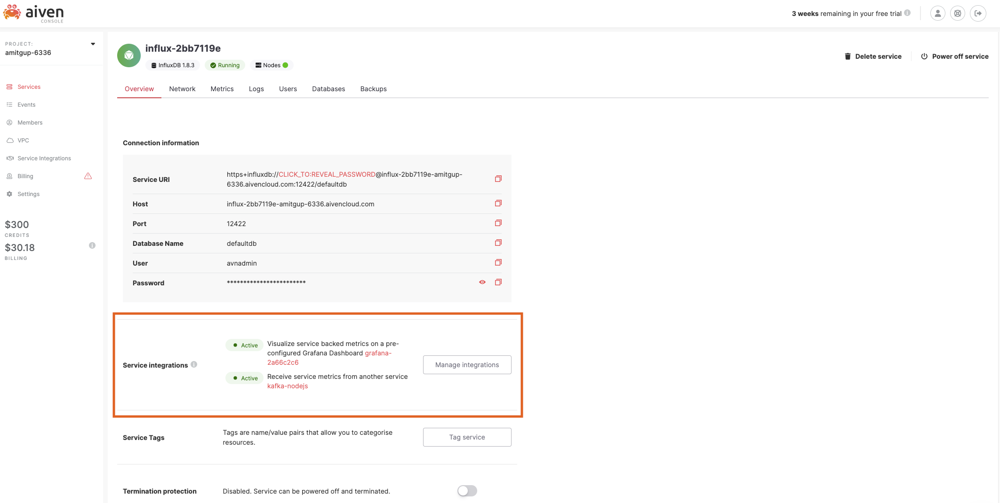

## Grafana Dashboard

With integrations enabled in the previous step, Aiven will take care of all the configurations and plumbing behind the scene, and now it's ready for visualization in Grafana.

Launch Grafana web ui using 'Service URI', User and Password from Grafana service overview:
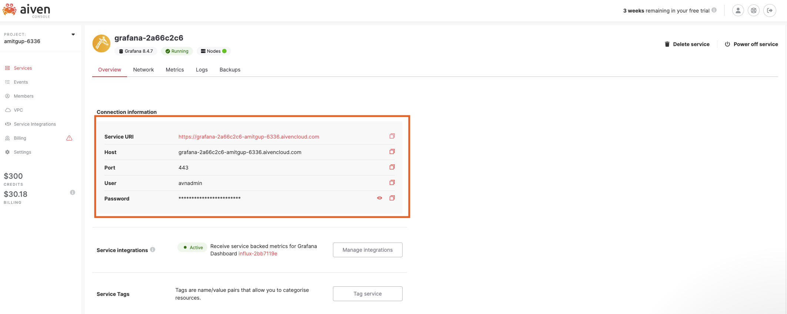

Aiven automatically creates and maintain a dashboard which can be found under 'Dashboards' > 'Browse':

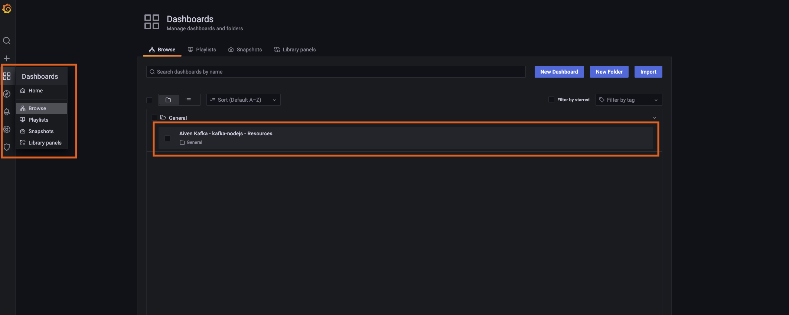

Launch the Aiven Kafka dashboard. The dashboard provides System as well as Kafka specific metrics.

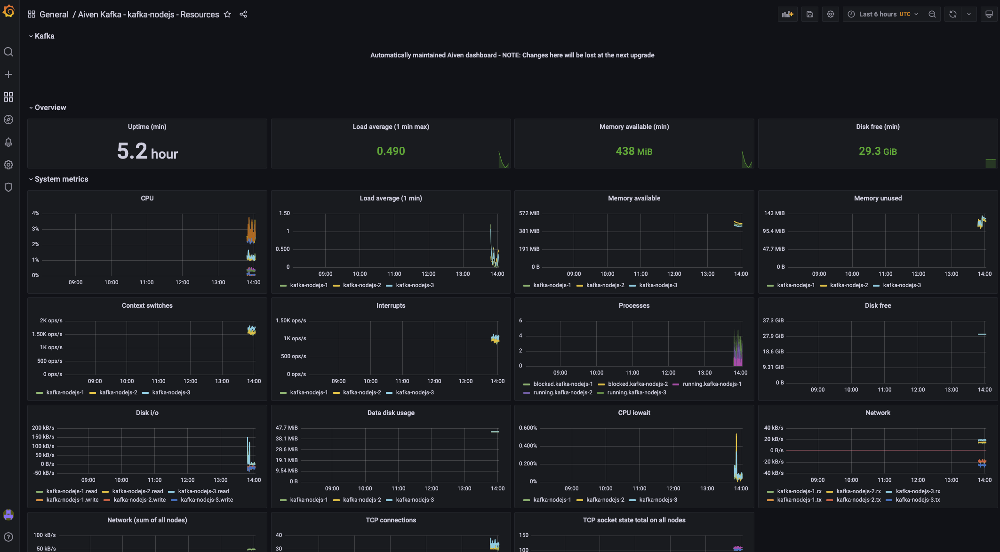

# Conclusion

In this article we have deployed a Aiven kafka service along with a Node.js program to connect and publish messages to our kafka service. We have also set up monitoring for our kafka service using Aiven InfluxDB and Grafana services. Through this article we demonstrated Aiven's capabilities that makes it very easy to create, configure and integrate data services with just a few clicks.
